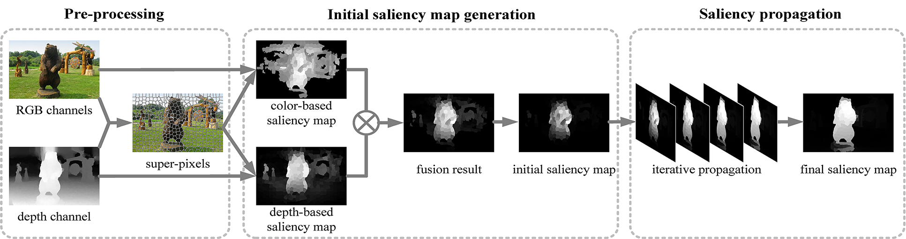

## SALIENT OBJECT DETECTION FOR RGB-D IMAGE VIA SALIENCY EVOLUTION

The paper is available [here](http://software.nju.edu.cn/rentw/publication/icme16-guojf.pdf).

### Abstract

Salient object detection aims to detect the most attractive objects in images, which has been widely used as a fundamental of various multimedia applications. In this paper, we propose a novel salient object detection method for RGB-D images based on evolution strategy. Firstly, we independently generate two saliency maps on color channel and depth channel of a given RGB-D image based on its super-pixels representation. Then, we fuse the two saliency maps with refinement to provide an initial saliency map with high precision. Finally, we utilize cellular automata to iteratively propagate saliency on the initial saliency map and generate the final detection result with complete salient objects.

### Framework



### Citing

If you find this code useful in your research, please consider citing the following paper:
```
@inproceedings{guo2016salient,
    title={Salient object detection for RGB-D image via saliency evolution},
    author={Guo, Jingfan and Ren, Tongwei and Bei, Jia},
    booktitle={2016 IEEE International Conference on Multimedia and Expo (ICME)},
    pages={1--6},
    year={2016},
    organization={IEEE}
}
```


## Usage

- Compile the mex file
```
mex SLIC_rgbd.cpp
```
- Run `demo.m`
    - This demo reads RGB images and depth images from the `img` and `dep` folders, respectively
    - The generated saliency maps will be saved in the `result` folder


## Contact

If you have any questions about this work or code which may interest other researchers, feel free to open an issue.


